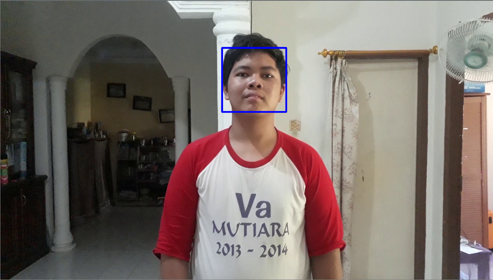
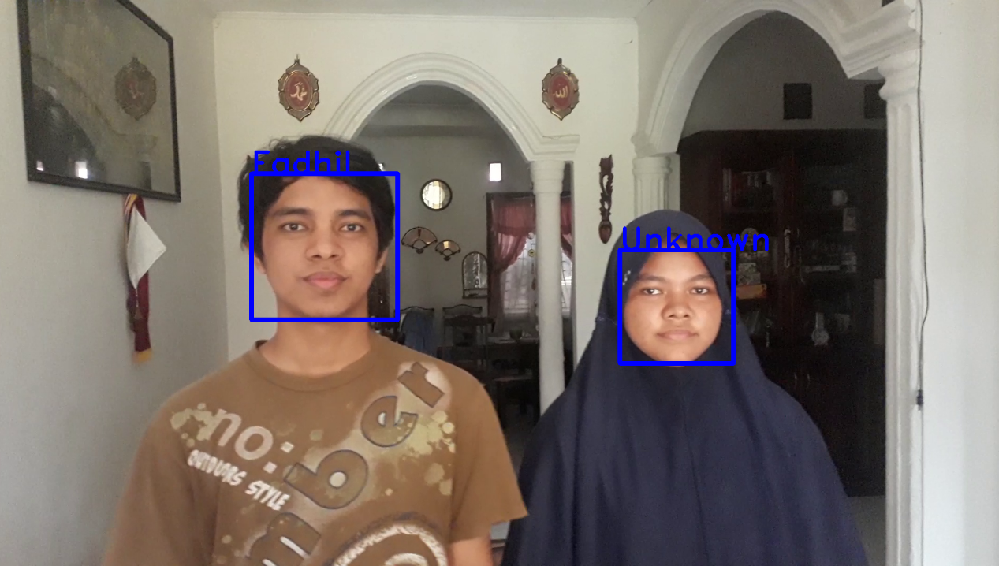
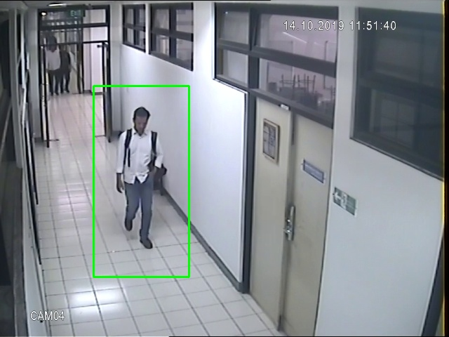
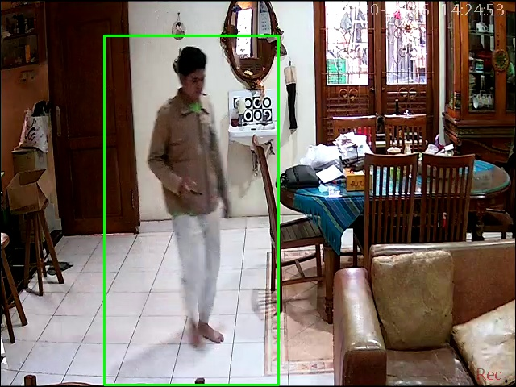

# Deteksi Kejadian Tak Diinginkan Menggunakan CCTV

## Overview
CCTV sering digunakan untuk mengawasi ruangan baik terbuka atau tertutup dari kejadian yang tidak diinginkan seperti pencurian atau barang tertinggal. Namun, kerap kali kejadian yang tak diinginkan tersebut hanya terekam oleh CCTV dan sulit untuk ditindak lanjut. Kami menggunakan algortima pendeteksi identitas manusia untuk memperingatkan penjaga keamanan apabila terjadi kejadian tak diinginkan yang terekam oleh CCTV.

Algoritma dibuat menggunakan python. Jadi, segala penjelasan terkait modul yang diperlukan, kode yang diupload dan hal-hal lain terkait penggunaan algoritma yang kami buat disajikan dalam format yang digunakan python.

## Dependencies
untuk dapat menjalankan seluruh algoritma yang kami buat, terdapat beberapa modul yang harus diinstall di python anda terlebih dahulu, yaitu :
* OpenCV
note : Harap menginstall modul opencv-contrib-python dikarenakan modul ini memuat modul utama sekaligus modul contrib yang bakal diperlukan selama proses pengerjaan.
* numpy
* imutils
* playsound
* time

## General Idea
Untuk memahami bagaimana algoritma bekerja, mari kita definisikan kejadian tak diinginkan terlebih dahulu. Kami mendefinisikan kejadian tak diinginkan sebagai adanya orang tak dikenal saja pada CCTV yang terekam selama waktu tertentu. Ada 3 poin utama, yaitu :

1. Hanya terdapat orang tak dikenal
2. Orang tak dikenal terlihat oleh CCTV
3. Orang tak dikenal terekam selama waktu tertentu

dari ketiga poin tersebut, maka kami membuat sebuah algoritma yang mampu :

1. Mengetahui identitas orang melalui wajah yang terekam
2. Mendeteksi orang tersebut
3. Menentukan apakah orang tersebut terekam selama durasi waktu tertentu

## Detekesi dan pengenalan Wajah Menggunakan HaarCascade
Untuk mendeteksi wajah menggunaakan kamera, kami menggunakan algoritma Viola Jones. Prosedur deteksi wajah Viola-Jones mengklasifikasikan gambar berdasarkan pada nilai fitur sederhana. Sehingga metode algoritma Viola Jones merupakan salah satu metode deteksi wajah dengan tingkat akurasi yang tinggi dan komputasi yang cepat. Algoritma Viola Jones menggunakan fitur Haar sebagai deskriptor kemudian menggabungkan Integral Image dan AdaBoost Classifier untuk mencari dan melakukan seleksi nilai fitur dan membentuk Cascade Classifier. Classifier tersebut yang akan digunakan untuk mendeteksi wajah pada gambar. Jika tertarik untuk membaca lebih mendalam mengenai Algoritma Viola Jones dapat mengakses [di sini](https://www.superdatascience.com/blogs/opencv-face-recognition) atau untuk yang berbasis project bisa diakses [disini](https://towardsdatascience.com/the-intuition-behind-facial-detection-the-viola-jones-algorithm-29d9106b6999#:~:text=The%20Viola%2DJones%20algorithm%20first,which%20will%20be%20explained%20later.)

Berikut ini contoh deteksi wajah manusia yang kami lakukan



Untuk mengenali wajah, kami menggunakan sistem training terhadap classifier dengan menggunakan data training. Lalu hasil training akan dijadikan untuk penentu identitas wajah yang dideteksi dengan menggunakan fungsi ***faceRecognizer.predict*** yang merupakan fungsi bawaan dari openCV untuk mendeteksi kemiripan gambar dengan array input. Untuk memahami lebih dalam terkait fungsi ini bisa diakses [disini](https://docs.opencv.org/2.4/modules/contrib/doc/facerec/facerec_api.html#facerecognizer-predict).

Berikut ini contoh pengenalan id wajah manusia yang kami lakukan



Untuk uji coba bisa dilakukan dengan melakukan run pada code yang disediakan. Harap disesuaikan beberapa nama folder, directory dan parameter sesuai yang digunakan.

## Deteksi Manusia Menggunakan HOG-SVM
Untuk mendeteksi keberadaan manusia yang terekam kamera, kami menggunakan algoritma HOG-SVM. HOG(Histogram Oriented Gradients) merupakan fitur yang kami ekstraksi untuk membedakan mana manusia dan mana yang bukan. Jika anda tertarik lebih dalam mengenai HOG, anda dapat membacanya [di sini](https://www.analyticsvidhya.com/blog/2019/09/feature-engineering-images-introduction-hog-feature-descriptor/). Kami menggunakan fungsi bawaan dari openCV untuk mengekstraksi fitur HOG, yang kemudian diklasifikasi oleh SVM.

SVM (Support Vector Machine) merupakan salah satu metode supervised machine learning. Metode ini sering dipakai untuk klasifikasi dua jenis benda. Sehingga cocok untuk tujuan kami yaitu mendeteksi manusia yang ada di rekaman CCTV. Apabila anda tertarik lebih jauh, anda dapar mempelajarinya [di sini](https://scikit-learn.org/stable/modules/svm.html). Sama seperti HOG, kami mneggunakan fungsi yang ada dalam openCV untuk melakukan klasifikasi menggunakan SVM.

Berikut ini contoh deteksi manusia yang kami lakukan




Anda dapat melakukan deteksi manusia saja menggunakan Human_Recog.py. Parameter-parameter yang kami gunakan bertujuan untuk mendeteksi manusia dalam ruangan. Bila anda menginginkan deteksi di tempat lain atau merasa hasilnya kurang akurat, kami sarankan anda mengubah parameter fungsi ***hog.DetectMultiscale()***. Penjelasan setiap parameter yang ada dalam fungsi tersebut dapat anda baca [di sini](https://www.pyimagesearch.com/2015/11/16/hog-detectmultiscale-parameters-explained/)

Selebihnya, anda hanya tinggal me-run saja kodenya. Jangan lupa untuk mengganti nama dan directory video dengan nama dan directory video yang anda ingin gunakan.

## Durasi dan Alarm
Untuk menentukan durasi deteksi, kami memanfaatkan fungsi ***hog.DetectMultiScale()***. Fungsi tersebut mengembalikan lokasi manusia berbentuk koordinat. Sehingga dapat dijadikan acuan apakah dalam video terdeteksi manusia atau tidak. Durasi dapat dihitung dengan menggunakan array timestamp berisi tiga nilai, waktu pertama terdeteksi, waktu terakhir terdeteksi dan status. Kira-kira array akan terlihat seperti ini

```
timestamp [waktu awal,waktu akhir, status]
```
varaiabel status digunakan untuk menentukan apakah deteksi awal sudah dilakukan. Pada kode yang kami buat, nilai diset False ketika deteksi pertama belum dilakukan. Sehingga timestamp waktu awal akan diupdate. Kemudian status berubah menjadi True apabila deteksi pertama sudah dilakukan. Sehingga waktu akhir bisa diambil dan durasi bisa dihitung
## Cara menggunakan kode program

### Face Recognition

### Human Detection
